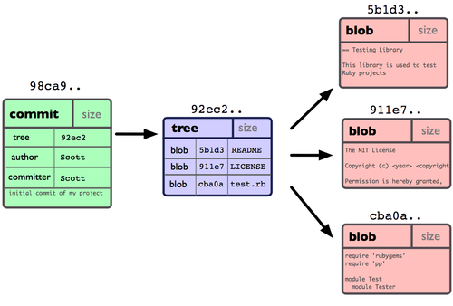

# Git with Confidence


## References ##
 - [ProGit](http://git-scm.com/book)
  - The book is on [GitHub](https://github.com/progit/progit)!
 - [Git from the bottom up](http://ftp.newartisans.com/pub/git.from.bottom.up.pdf)
  - This link is broken as of 2/24, so I've included the [pdf](/2014/0225-git_with_confidence/references/git.from.bottom.up.pdf) in the repository.

## Git objects ##

- **repository**: A collection of **commits** which serves as an archive of 
                what the project's **working tree** looked like over time. It also stores additional data,
                like **branches**, **tags**, and **HEAD**.

- **commit**: A snapshop of your working tree at some point in time.

- **the index**: A staging area for registering changes which are to be commited.

- **working tree**: A directory of your filesystem which has a repository associated with it (
                  stored in the .git hidden directory). The working tree includes all directories
                  and subdirectories in the working tree directory.

- **blob**: A container for file content. Blobs are featureless and store only content, but no metdata - not 
even a filename.

- **branch**: A named reference to a commit. A branch can point to different commits over time.

- **tag**: A named reference to a commit. A tag always points to the same commit. 

- **HEAD**: A reference which specifies what is currently checked out. HEAD could
  refer to a branch or to a commit.

### Workflow ###

Relationship between the repository, the working tree, and the index:

<div style="text-align: center;">

</div>

Commands:

  - `git init`
  - `git add`
  - `git status`
  - `git commit`
  - `git checkout <branch or commit>`

### How git stores data ###

Git stores data in **blobs**, **trees**, and **commits**. Git is a **content addressable filesystem**, meaning data
is stored in key-value pairs. The key is the SHA-1 hash of the object's contents, and the value is the
content itself.

- A file is stored as a **blob** object.
- A **tree** points to blobs and other trees (i.e. subdirectories) and provide a filename for each.
- A **commit** points to the commits which preceed it, and additional metadata (such as the commit message, author, author e-mail.)

This is what a tree looks like:

<div style="text-align: center;">

</div>

This is what a commit looks like:

<div style="text-align: center;">

</div>

This is what several commits look like:

<div style="text-align: center;">

</div>

This is what a branch looks like:

<div style="text-align: center;">

</div>

You can explore blobs, trees, and commits using `git cat-file`:

```
$ git cat-file -t 5eab59d5579379e7ac24ca8d0515e077bbd7bb9c

commit
```


```
$ git cat-file -p 5eab59d5579379e7ac24ca8d0515e077bbd7bb9c

tree cb8fef9d6f9b6c2b017358c346029ef1fe96d18e
parent 0227a74bfc5aa251023e5a411c6a9f49ce1f437f
author Keith Hughitt <keith.hughitt@gmail.com> 1392847696 -0500
committer Keith Hughitt <keith.hughitt@gmail.com> 1392847696 -0500

Added Steve Mount's RNA-Seq normalization presentation
```

```
$ git cat-file -p cb8fef9d6f9b6c2b017358c346029ef1fe96d18e

100644 blob 7870d377e7ec5614635ad12d8a27a259a158e702  .gitignore
100644 blob ccb3f02c1748511dd015ab81853b46fe24552893  .gitmodules
040000 tree 5589118a2783e8ff1e3c79559e0d7a02b6fc5ba2  2013
040000 tree e2c10734af096e4dda2c70774869dbdc405f58f3  2014
100644 blob bf96193bc23063b53acc1094b939def349b63c69  README.md
```


